blockchain
# 小白也能懂的比特币及区块链原理  
文中尽量以大白话讲解比特币及区块链的基本原理，一步一步的画出区块链的鸟瞰图。  
！！！相关概念描述并不严谨，仅是面向于小白的小白化说明。  

## 初探  
#### 比特币  
一种加密数字货币（也叫加密货币）。  
什么是数字货币？比如：Q币、游戏币.....。哦，原来这么简单，那加密货币就是加密了的数字货币，这有什么好玩的？嗯......，咱们继续看......  
#### 区块链  
......，这个名词，看起来很深奥，先绕过......  
#### 比特币和区块链的关系  
- 先讲个故事  
某宿舍有六个人，大家经常出去吃喝玩耍，每次吃喝玩耍结束都需要付款，每次都AA很麻烦，所以约定大家轮流付款并记账，每月月底按账本结算平摊。  
这个账本使用先进的**防篡改技术**(比如花色底纹:-) )，由专人记账。在每笔付款记录之后都有一个签名栏，由付款人**签名确认**。这个账本装订良好，每一页都有先后顺序，任何人都**无法抽取替换**其中任何一页来作假。  
你可能会说，不能篡改，那另做一个账本，把原来那个账本替换掉不就可以了。好吧，你很聪明，为了防止这种居心不良的人，咱们建立六个内容相同的账本，每人都保存一个，这叫**分布式**保存，哈哈！  

- 再看比特币和区块链  
比特币和区块链类似于上面故事中的付款记录和账本，故事中的账本对应区块链，如下图：  
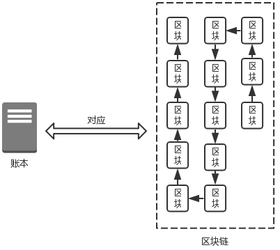  

账本中的每一页对应区块链中的一个区块（区块，就是记录了很多条比特币交易记录的数据块），账本中的付款记录对应区块中交易记录：  
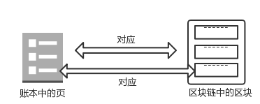  

故事中我们为了安全,建立了六个相同的账本，每人保管一份：  
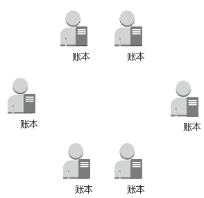  

而区块链中，每一份完整的区块链数据分布保存在世界各地的计算机中，这些计算机通过通信网络相连接，每台计算机都被称为网络中的一个节点：  
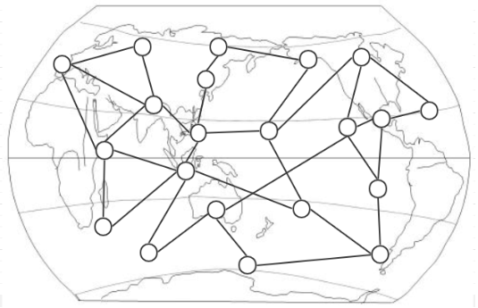  
区块链的安全性远比账本要高：账本中的签名是可以模仿的；有六个帐本也可能被全部替换掉。而在比特币的运行机制中这种情况几乎不可能发生，而这个[几乎不可能]基本等于[不可能]。为什么这么说，咱们继续分解......  

## 数字签名  
在前面故事中，每个付款人都要对自己的付款记录进行签字，以确认这条付款记录是正确的，并且这笔钱是自己付的。比特币在交易过程中也会产生很多交易记录，而这些记录都是通过数字签名来确认的。  
数字签名广泛应用于电子商务、在线支付等业务场景中,由一个私钥和一个公钥组成。  
- 私钥  
其实就是一个随机数，通过一定的算法，使得每次产生的这个随机数不同。  
- 公钥  
是通过私钥推算（椭圆曲线算法）出来的。但是，不能通过公钥反推出私钥。  
- 用法  
使用私钥对某个信息签名，将得到的数字签名、公钥、信息发送给其他人，那么其他人就可以通过公钥和数字签名就能验证信息，确认信息是否正确。如果信息在传输过程被修改过，那怕是被修改过一个标点符号，或添加了一个空格，对信息的验证都会失败。  
  - 签名函数(交易记录，私钥)=>数字签名  
  - 验证函数(交易记录，公钥，数字签名)=>验证通过  

数字签名是无法伪造的，一个私钥对一个消息只能的产生一个数字签名。在比特币交易中，有两个地方使用了数字签名：  
- 对交易记录签名  
交易付款人付款时，会用付款人的私钥对交易记录签名，以证明这笔钱是付款人支付的。  
- 证明对比特币的所有权  
付款人通过数字签名，证明支出的这些比特币是他自己的（通过解锁脚本，欲了解详情，请参考本文后附的链接）。  

## 数据特征码  
比特币是通过哈希算法(SHA-256和RipeMD160)计算数据的哈希值的，哈希值有什么用呢？我们可以理解为哈希值是数据特征码，这个特征码能够唯一代表这块数据。数据不同产生的特征码不同，对数据的任何细小改动，都会使得最终得到的数据特征码不同。  
那么,这个特征码有什么用呢？  
先看看区块的结构：  
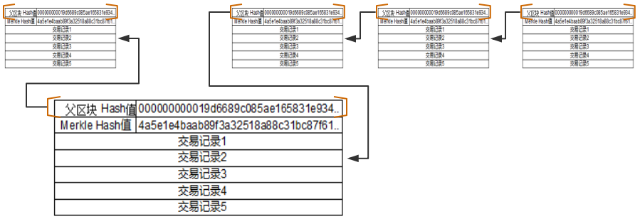  

从上图中我们看到区块有两部分组成，hash值组成的**区块头**和交易记录组成的**区块体**（为了便于理解此处区块头和交易记录都做了简化）。  
- 区块头  
区块头中有两个Hash值，分别是父区块Hash和Merkle Hash。  
  - 父区块Hash  
  父区块Hash保存的是上一个区块的特征码。  
  区块链中就是通过在子区块中保存父区块特征码，使得子区块与父区块建立连接，最终建立一个完整区块链条。在比特币中这个链条就是**比特币账本**。  
  说到这里，我们就需要修正之前一个的“错误”：那个“账本对应区块链”的描述是不准确的，现修改如下：  
  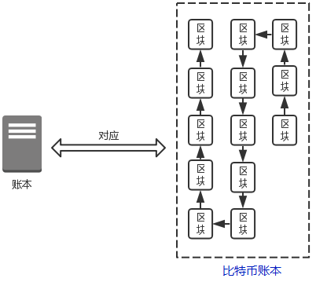  
  - Merkle Hash  
  Merkle Hash是对区块中所有交易记录计算出的一个总的特征码。  
  这个特征码是怎么算出来的？  
  我们以一个区块中有四笔交易记录为例：  
  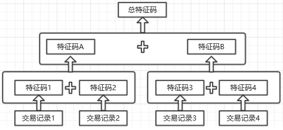  
    - 分别算出交易记录1和交易记录2的特征码（特征码1和特征码2），将特征码2接到特征码1的后面组成一个新的数据，算出这个新数据的特征码A;  
    - 分别算出交易记录3和交易记录4的特征码（特征码3和特征码4），将特征码4接到特征码3的后面组成一个新的数据，以新数据算出特征码B;  
    - 将特征码B接到特征码A后面，算出所有交易记录的总特征码，即Merkle Hash  
    
    对上面的步骤我们做进一步的整理：  
    - 除了交易记录，其他都是对特征码进行计算,即下面圈出的部分：  
      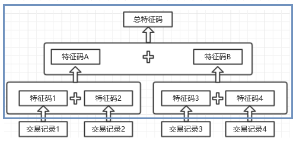  
    - 圈出的这部分像一棵倒置的树，专业叫法是**Merkle树**(Merkle Tree)  
    - 生成总特征码的基本规则：**两个**特征码按生成的**先后顺序**连接到一起组成新数据，来生成新特征码  
    - 总特征码位于树的根部，也就是树的根节点，因而总特征码的专业叫法是**Merkle根**  
    - 如此算出来的总特征码才能代表区块中的所有交易记录，区块中的任何信息包括交易记录的先后顺序都不能变动，只要有变动就无法对应上已经算出来的总特征码，说明数据被改动过。  
  - 区块Hash  
    对区块头计算Hash得到的特征码即区块Hash。因为区块头中包含了代表所有交易记录Merke Hash，所以仅对区块头计算出的特征码就可以代表整个区块。  
    需要注意的是，区块中并不会保存区块自己的区块Hash,而是在子区块保存“父区块的Hash”。  

  有人说偶数条记录可能两两组合生成逐级生成特征码，那我有奇数条记录怎么办呢？有了前面的知识，再参考下图应该就能明白了，这里就不多做解释了。  
  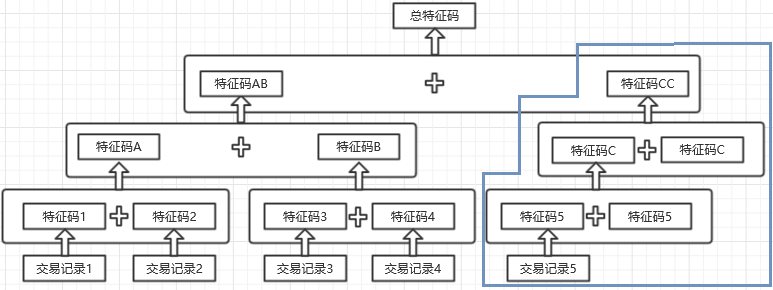  
## 不可篡改  
读到这里细心的你可能已经对区块链的不可篡改原理有了一些了解：对区块中的任意交易记录任何修改都会引起数据验证无法通过。  
#### 引申一下前面的内容  
如果你想修改一条了交易记录，为了这条修改后的记录合法，你需要：  
- 修改区块  
计算这条记录在Merkle树上所经路径的所有特征码，以5条记录中第1条记录被修改为例：  
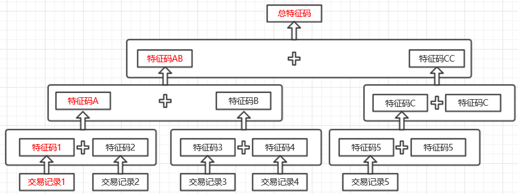  
上图中红色字体部分是修改【交易记录1】而引起重算的所有特征码。这里只是以5条记录为例，实际上，目前一个区块(1M)中依交易记录大小的不同有可能会存放3000~4000条记录。  
- 修改链  
上面只是区块内的变化，由于总特征码(Merkle Hash)变了，这会使得区块Hash变化，而区块Hash变化，意味着子区块中的“父区块Hash”的值变化，导致子区块的区块Hash变化，如此产生级联效应，引起这条链上被修改区块之后的所有区块Hash都需要重算并改写：  
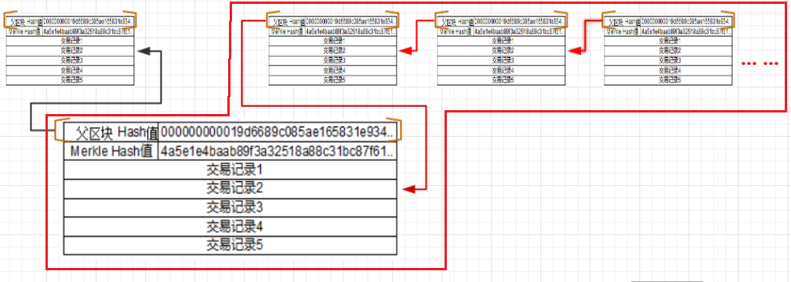  
- 全网认可  
前面的修改成本就已经很大了，但是想要你的修改被全网认可，那么你需要拥有全网51%以上的算力才可能实现。  

#### 挖矿  
挖矿，这个名词用在软件系统中似乎让人有些摸不着头脑。其实它是指按照比特币特定规则计算出指定区块的区块Hash的过程，新的区块只有在计算出区块Hash才能放上链并被全网认可。但是，这个过程跟挖矿有什么关系呢？为什么会被称为“挖矿”呢？这得从区块Hash的计算过程说起。  
- 区块头结构  
  之前为了便于理解，区块头我只给出了[父区块Hash]和[Merkle Hash],下面我们看一下完整的区块头结构：  
  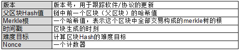  

- 难度目标和Nonce  
  我们已经知道，区块Hash就是计算出的区块头的Hash。但是在比特币的设计中人为的为区块Hash的计算设置了难度，使得区块Hash必须通过千百万次的反复计算才能得到。只有了解了这个计算过程，才会对比特币的不可篡改性有更清楚的了解。  
  - **难度目标**，其实是一个数值，把它转换为16进制时，应该像下面这样：  
  00000000000000000285ae165831e934ff763ae46a2a6c172b3f1b60a8ce26f  
  而我们计算出的区块Hash往往是这样：  
  c91c008c26e50763e9f548bb8b2fc323735f73577effbc55502c51eb4cc7cf2e  
  注意：这两个数值长度相同，而难度目标是以17个0开始的，意味着它远比前面这个区块Hash要小，而**难度目标**的意思是，你算出的区块Hash值必须**小于难度目标**。区块头中的各项数据的值都是固定的（除了Nonce），而相同的数据只能得到同一个Hash,那么聪明的你可能已经意识到，要使得区块Hash变化，就需要改变Nonce的值。  
  - **Nonce**，是一个计数器。我们不断的变化Nonce，使得计算出的区块Hash不断变化，直到有一个区块Hash小于难度目标。想要得到一个以17个0开始的Hash值可能需要千万次甚至亿万次的试错，而要得到小于难度目标的值更是难上加难。这就好像挖金矿一样，不断挖不断挖，直到挖出你想要的那粒金子来。  
  
  难度目标也不是一尘不变的，它会根据全网算力，将算出一个区块Hash的平均时间控制在10分钟左右。随着时间推移，挖矿人数和计算机性能都会不断的提高，为了把新区块的产生时间控制在10分钟左右，相应的挖矿难度也会不断增加，也就是不断减小难度目标，增加难度目标前面的0。  

修改交易记录的巨大成本+挖矿难度的限制，想要篡改数据？呵呵，你试试看……，:-)  

## 矿工、挖矿奖励及交易费  
  - 矿工  
  在区块链中挖矿确实是会挖到“金子”的，这“金子”就是挖矿奖励和交易费。所以才会有那么那么多人争先恐后的在区块链上挖矿，这些探矿的人被称为**矿工**。  
  矿工工作是验证每一笔新创建的交易记录，并把它们打包进区块，然后计算出符合难度目标的区块Hash值。这个过程有所有矿工在同时进行的，第一个计算出区块Hash矿工会将新区块添加到区块链上并全网广播，同时也将获得挖矿奖励和交易费。  
  - 挖矿奖励  
    系统奖励给矿工的比特币，这也是比特币产生的来源，比特币就是通过挖矿奖励进入比特币市场流通的。  
    比特币总量被限制为约2100万个比特币，初始挖矿奖励为每个区块50个比特币，以后每4年减半,现在(2018年，自2016始)挖矿奖励为每个区块12.5个比特币。最终所有比特币发完后，矿工将只能通过交易费获取收益。  
  - 交易费  
    相当于比特币交易者给矿工的小费，交易费高的交易记录往往会被矿工优先打包进区块。交易费低的或者没有交易费的会被推迟打包，甚至有可能不会被打包，交易信息也就不会得到确认，也就意味着这笔交易不被认可。  

## 重申  
本文仅是面向于小白的对比特币和区块链基本概念和原理的小白化说明，很多描述并不严谨，如果你想了解更专业的相关知识，可以参考[精通比特币](http://zhibimo.com/read/wang-miao/mastering-bitcoin/index.html)这本书。  
