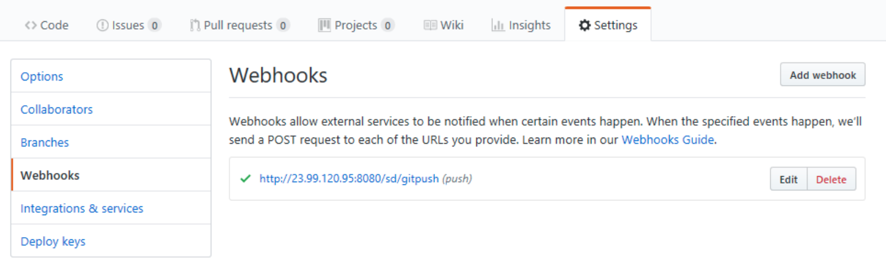
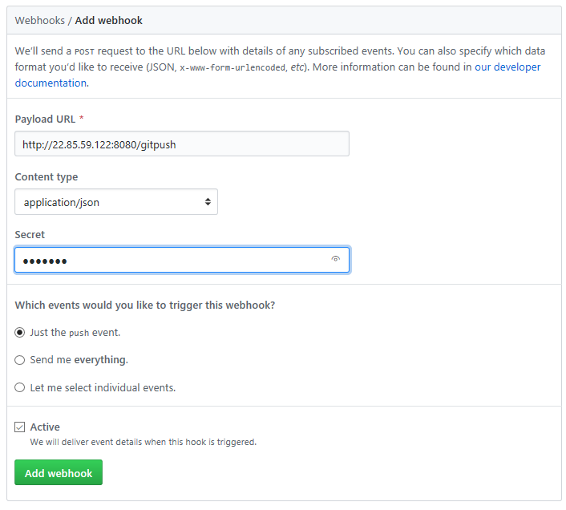
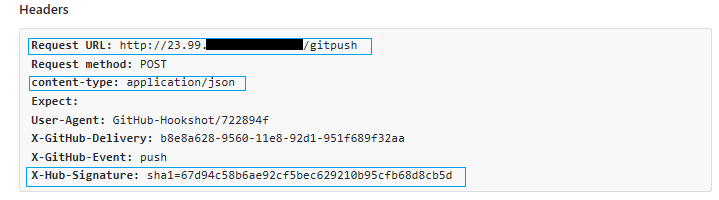
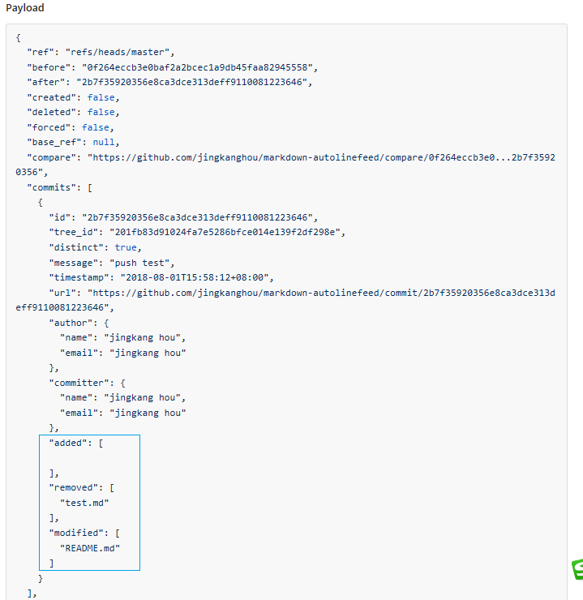

github,go
# Webhooks实践(Go语言)  

项目需要，百度了一下Github Webhooks，内容基本雷同，也没有找到我想要的如下两个功能说明：  
- 提交时做了哪些变动？  
- secret的使用  

罢了，想拿来即用的偷懒之路走不通，只能老老实实啃[官方文档](https://developer.github.com/webhooks/)了。  
### Webhooks干嘛用的？  
Github Webhooks提供了一堆事件，这些事件在用户特定的操作下会被触发，比如创建分支(Branch)、库被fork、项目被star、用户push了代码等等。  
我们可以自己写一个服务,将服务的URL交给Webhooks，当上述事件被触发时，Webhook会向这个服务发送一个POST请求，请求中附带着该事件相关的详细描述信息(即Payload)。  
这样，我们就可以在自己服务中知道Github的什么事件被触发了，事件的内容是什么？据此我们就可以干一些自己想干的事了。能干什么呢？官方说`You're only limited by your imagination`，就是说想干什么都行，就看你的想像力够不够 :)  
### Webhooks配置  
进入要hook的库-->Settings-->Webhooks-->Add Webhook  
  
Add Webhook界面长这样：  
  
- Payload URL  
就是我们用来接收事件详情(Payload)的服务URL  
- Content type  
即Webhooks用什么样的数据格式给我们发送Payload,Webhooks支持以下两种类型的数据  
  - application/json  
  - application/x-www-form-urlencoded  
- Secret  
这里可以提供一个加密Key,Webhooks会以此key生成Payload的一个数字签名随POST请求发送给你，你可以通过此签名验证数据的合法性。如何验证，见后文所附代码。  
- Webhook event  
Webhooks事件的选择项:  
  - Just the push event  
	仅hook Push事件  
  - Send me everything  
	hook所有事件  
  - Let me select indiidual event  
	让用户自己选择hook什么事件  
	
  默认是`Just the push event.`,我们不改了，用它得了。  

### Post了什么东东  
在写服务之前，我们先看看Webhooks给我们发送了什么。  
- Post Request Header  
    
	- Request URL  
   即前面配置中填写的“Payload URL”  
	- content-type  
  即前面配置中选择的“Content type”  
	- X-Hub-Signature  
  是对Payload计算得出的签名。当我们在前面的配置中输入了“Secret”后，Header中才会出现此项。[官方文档](https://developer.github.com/webhooks/securing/)对Secret作了详细说明，后面我们也会在代码中实现对它的校验。  
- Post Request Body  
    
	这是触发Push事件时Webhooks发给我们的Payload,蓝色框中的内容就是我期望得到的库文件的变动信息。很直白，不再解释。有了数据结构，拿到想要的数据就不是难事了，所以后面代码中也不会有这部分内容了。  

### 我们的服务怎么写？  
本文中使用Gin实现所需功能，代码仅用于演示，请轻拍 :)  
``` go  
func Init(g *gin.Engine, mw ...gin.HandlerFunc) *gin.Engine {  
	// Middlewares.  
	g.Use(mw...)  

	// 404 处理  
	g.NoRoute(func(c *gin.Context) {  
		c.String(http.StatusNotFound, "The incorrect API route.")  
	})  

	// 路由  
	sv := g.Group("/sv")  
	{  
		sv.POST("/gitpush", gitpush)  
		// 其它路由定义......  
	}  

	return g  
}  

// Github Webhooks Post请求处理函数  
func gitpush(c *gin.Context) {  
	// 验证签名  
	if matched, _ := verifySignature(c); !matched {  
		err := "Signatures didn't match!"  
		c.String(http.StatusForbidden, err)  
		fmt.Println(err)  
		return  
	}  

	fmt.Println("Signatures is match! go!")  

	// 你自己的业务逻辑......  

	c.String(http.StatusOK, "OK")  
}  

// 验证签名  
func verifySignature(c *gin.Context) (bool, error) {  
	payloadBody, err := c.GetRawData()  
	if err != nil {  
		return false, err  
	}  

	// 获取请求头中的签名信息  
	hSignature := c.GetHeader("X-Hub-Signature")  

	// 计算Payload签名  
	signature := hmacSha1(payloadBody)  

	return (hSignature == signature), nil  

}  

// hmac-sha1  
func hmacSha1(payloadBody []byte) string {  
	h := hmac.New(sha1.New, []byte("Sbjylss38"))  
	h.Write(payloadBody)  
	return "sha1=" + hex.EncodeToString(h.Sum(nil))  
}  
```  
