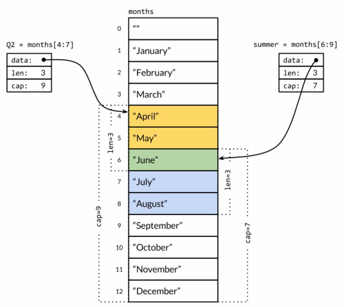

go
# Go语言有什么不同？  
> Go让我体验到了从未有过的**开发效率**。
> --Go作者之一：罗布·派克(Rob Pike)

开发效率，是的，我们新入这门开发语言最直接的感受就是语法简洁高效，甚至有人用“逆天”两个字来形容它的这一特色。本文就抛开其他，看看Go语言倒底有什么不同，它如何帮我们提高开发效率。

## 不需加分号  
  Go语言不需要在语句或者声明的末尾加分号，编译器会主动加分号。少写一个字是一个字 :)。
  如果你喜欢个性化的代码风格，需要参与一下[附录--关于分号](#%E5%85%B3%E4%BA%8E%E5%88%86%E5%8F%B7)。
  
## 格式化工具  
Go自带了格式化工具  
- gofmt  
  Go语言在代码格式化上态度很强硬。gofmt会按标准格式化代码，没有任何参数，你只能按标准走。你不用操心什么样的代码风格更好，执行标准就行，简单了很多，少了不必要的撒逼。  
- goimports  
  根据需要，自动添加或删除import声明。这个省了不少事。  
  这个工具没包含在标准包中，可以`go get golang.org/x/tools/goimports`  

> gofmt和goimports在一些开发工具中(vscode,idea...)会自动执行，你再也不需要苦逼的去手动执行了。  

## 隐式初始化  
如果声明变量时，没有显式初始化，则被隐式初始化为变量类型的0值。  
- 不同类型的零值  
  - 数值，0  
  - 字符串，""  
  - 布尔，false  
  - 接口或引用类型, nil  

> 不需要操心undefined了  
## 自增&自减  
和C系其他语言一样，Go也有++和--，但是Go语言中**自增自减是语句不是表达式**,并且++和--只能放在变量后。所以注意以下用法：  
``` go  
  // 合法  
  i++  
  i--  

  // 非法，自增自减不是表达式  
  j = i++  
  j = i--  

  // 非法，++和--只能放在变量后面  
  ++i  
  --i  
```  
我记得曾有同学分不清C语言中的`++i`和`i++`，另外，像`j = ++i`这种用法更是扰乱视听。现在好了，解放了，老老实实用好`i++`和`i--`就够了
## 空标识符  
Go语言不允许使用无用的变量，因此就有了空标识符，即_（下划线）。
空标识符多用在接收函数多返回值时，对不需要的返回值作占位用。  

## 短变量声明  
在函数内可以用`a:=3`的方式声明变量，编译器会自动推算出变量a的数据类型。  
简洁，但只能用在函数内。  
> 用过Pascal的同学可能注意到 `':='` 的用法，没错，Go语言不但继承了C的很多思想，Go的另一支继承分支就是Pascal  

## 多重赋值  
Go语言中可以这样用：  
``` go  
// 声明变量i和j   结果：类型都是int，i的值是0，j的值是1  
i, j := 0, 1  

// 给i和j重新赋值  结果：i的值是2，j的值是3  
i, j = 2, 3  

// 重点来了，变量值的交换  结果：i的值是3，j的值是2  
i, j = j, i  
// 当然，还可以这样：
a[i], a[j] = a[j], a[i]
// 还记得其他语言中通过临时变量来交换数据吗？上面的用法与其他语言相比，只能用幸福来形容:)  
  

// 计算斐波纳契数据的第n个数：
func gcd(x, y int) int {
  for y != 0 {
    x, y = y, x%y
  }
  return x
}

```  
## switch不需要break  
以前在其他语言中使用switch总是很麻烦，每个case语句之后都要加break,Go不需要！  
- 其他语言是这样
``` javascript
switch( foo ) {
  case "alpha":
    alpha();
    break;
  case "beta":
    beta();
    break;
  default:
    // something to default to
    break;
}
```
- Go语言是这样
``` Go
switch foo {
  case "alpha":
    alpha()
  case "beta":
    beta()
  default:
    // something to default to
}
```
> Go语言中，如果想要几个相邻的case执行同一段逻辑，需要自己显式的加入fallthrough语句。  
> 像这样不用break才合理嘛，毕竟fallthrough的方式很少用到。  

## 不需要Public、Private  
Go语言中，以**大写字母开头**的变量、函数命名作为公有变量（或函数）导出。也就是说外部的包只能访问以大写字母开头的变量（或函数）。结构体成员命名也遵循此规则。  

## 减少类型转换潜规则
#### 类型不同，不能运算
Go语言中，即使是基础类型相同，不同的类型之间也不能进行运算：
``` go
// 定义了两个不同类型Age和Num，其基础类型都是int16
type Age int16
type Num int16

func typeTest() {
  var myAge Age = 3
  var aNum Num = 4
  
  // myAge与aNum类型不同，compile error: type mismatch
  myAge = aNum - myAge
  
  // myAge与aNum类型不同，compile error: type mismatch
  if myAge == aNum {
    fmt.Println("ok")
  }

}
```
要想不同类型之间运算必须强制类型转换：
``` go

type Age int16
type Num int16

func typeTest() {
  var myAge Age = 3
  var aNum Num = 4
  
  // 使用Age(aNum)转换aNum
  myAge = Age(aNum) - myAge
  
  // 使用Age(aNum)转换aNum
  if myAge == Age(aNum) {
    fmt.Println("ok")
  }

}
```
#### 基础类型不同，不能转换
``` go

type Age int16
type Num int16
type FType float64

func typeTest() {
  var myAge Age = 3
  var aFloat FType = 5.5
  var sAge = "6"

  // 可以转换，但会将float截断，只保留整数
  myAge = Age(aFloat) - myAge
  // 输出结果：2
  fmt.Println(myAge)

  // 编译错误
  myAge = sAge
  // 编译错误
  myAge = Age(sAge)

}
```
Go语言中基本类型的转换需要[使用转换函数](https://www.cnblogs.com/heinoc/p/4106595.html)

上面两条类型转换相关的内容和高效有关系吗？
有，变量使用中没有那么多的隐式转换，不是更直接高效吗？对于我这种记不住那么多潜规则的懒人来说确实减轻了不少心智压力:)

## 常量
- 以省略方式批量初始化常量
``` Go
// 下面声明了5个常量
const (
  a = 1
  b
  c
  d = 2
  e
)

fmt.Println(a, b, c, d, e) //"1 1 1 2  2"
```
- iota常量生成器
在每一个const关键字出现时，iota被重置为0,每出现一个常量声明，iota自动加1
  ``` Go  
    const (
      a = iota // iota重置为0，a等于0
      b // iota自动加1,b等于1
      c // iota自动加1,c等于2
    )

    const (
      d = iota // iota重置为0，d等于0
      e // iota自动加1,e等于1
    )

    const f = iota // iota重置为0，f等于0
    const g = iota // iota重置为0，g等于0

    fmt.Println(a, b, c, d, e, f, g) //"0 1 2 0 1 0 0"
  ```
- 结合以上两种语法
  ``` Go
    const (
      a = iota // iota重置为0，a等于0
      b        // iota自增,b等于1
      c = "hh" // c等于“hh”,iota依然自增，等于2
      d        // d等于“hh”,iota依然自增，等于3
      e = iota // 恢复iota, iota自增，e等于4
      f        // iota自增,f等于5
      g        // iota自增,f等于6
    )

    fmt.Println(a, b, c, d, e, f, g) //0 1 hh hh 4 5 6

    const (
      _ = 1 << (10 * iota) // 1左移（10*0）位，还是1
      KB // 1左移（10*1）位，1024
      MB // 1左移（10*2）位，1048576
      GB // 1左移（10*3）位，1073741824
      TB // 1左移（10*4）位，1099511627776
      PB // 1左移（10*5）位，11125899906842624
      EB // 1左移（10*6）位，1152921504606846976
      ZB // 1左移（10*7）位，1180591620717411303424
      YB // 1左移（10*8）位，1208925819614629174706176
    )
    fmt.Println(KB, MB, GB, TB, PB, EB, (ZB / EB), (YB / EB))
    // 上面输出1024 1048576 1073741824 1099511627776 1125899906842624 1152921504606846976 1024 1048576
    // 注意：ZB和YB已经超出了int所能表达的最大数，在Go语言中它们依然可以参与运算，但不能赋值给变量，因为超出了变量范围
    
    fmt.Println(ZB) // compile error:overflows int
  ```
  Go语言中没有枚举，这就是枚举。又有一个概念不用学了，haha...
## Slice（切片）
切片切片，把数组切成片来用:),借用“Go语言圣经”中的图来说明：

图中**切片Q2**是一个引用类型，引用了数组months中index为4、5、6的三个元素供自己使用

## defer
在一个普通函数前加上defer关键字，那么这个函数会被延迟执行。defer后的函数直到包含该defer语句的函数执行完毕时，才会被执行。
- 其它语言中读写文件：
``` CSharp
void writeTxt(string msg)
{
  FileStream fs = null;
  try
  {
      fs = new FileStream(filename, FileMode.Create);
      // 文件操作...
  }
  catch(Exception ex)
  {
      // 处理异常
  }
  finally
  {
    if(fs != null)
    {
      fs.Close();
    }
  }
}
```
- 在Go语言中利用defer关键字，可以这样
``` go
func writeTxt(msg st){
  file1, err := os.Create("test.txt")
  defer file1.Close()

  if err != nil {
    // 处理错误。。。
  }
  // 文件操作...
}
```
这样简洁多了吧。打开文件后马上写关闭语句，更加清晰明了，也治愈了我那丢三落四的坏毛病:)
## 多返回值
用其他语言有可能会写出类似这样的代码：
``` CSharp
// 函数定义，除了返回一个bool值外，通过引用类型string来提供更友好的错误返回信息
public bool Connected(string localpath, ref string errMsg)
{
    // ....
    return connected;
}
``` 
``` CSharp
// 函数调用
string err = "";
if (!Connected(localPath, ref err))
{
    if (String.IsNullOrEmpty(err))
    {
      // 建立新连接
    }
    else
    {
      // 错误处理
    }
}
// 正常业务处理......
```
总感觉，用参数作返回值这种事，1.麻烦，2.不正规。
现在好了，Go语言的函数可以提供多个返回值：
``` go
// 函数定义
func Connected(localPath string) (bool, error){
  //......
  return connected, nil
}
```
``` go
// 函数调用  
isConnected, err := Connected(path) 
if err != nil {
  // 错误处理
}
if !isConnected {
  // 建立新连接
}
// 正常业务处理......
```
Go语言中常规错误处理都是这么做的，“不正规”的心理包袱可以放下了，而且，相比其他语言，相同业务逻辑其实现代码却更简单清晰了:)


## 没有类
类？没有类，Go语言里没有类！
没有类如何面向对象？！
如果有C++经验的同学应该记得这样一个概念“类的本质就是结构体”，Go语言就是从本质出发。
- 结构体
  ``` go
  // 这里定义了一个结构体
  type Point struct{ X, Y float64 }

  // 这里定义了一个函数
  func Distance(p, q Point) float64 {
    return math.Hypot(q.X-p.X, q.Y-p.Y)
  }
  ``` 
  定义方法：
  ``` go
  // 我们在函数前面加一个括号，里面放入`p Point`,那么这个函数就变成了Point的一个方法
  func (p Point) Distance(q Point) float64 {
    return math.Hypot(q.X-p.X, q.Y-p.Y)
  }
  // 方法的调用 
  p1 := Point{1, 2}
  p1.Distance(Point{4, 6})
  ```
  结构体成员（导出/非导出）+方法（导出/非导出）形成了**封装**。
    - 结构体嵌套
    ``` go
    type Point struct {
      X, Y int
    }
    type Circle struct {
      Center Point
      Radius int
    }
    ```
    在这样的结构体嵌套中，外层的结构体不仅仅是获得了内层结构体的所有成员，而且也获得了全部的方法，这是Go语言对面向对象**继承**特性实现。
- 类型
那么Go语言中结构体就相当于类？
也不尽然，细心的同学可能发现了，定义结构体时用了`type`关键字，其实通过`type`定义的类型都可以有方法。


## 接口
面向对象还有**多态**，咱们通过接口来体现。
#### 用法
定义一个接口：
``` go
type Namer interface {
  SetName(name string) 
  GetName() string
}
```
实现接口：
``` go
type Dog struct {
  dogName string
}

func (dog Dog) Run() {
  // ......
}

// 实现SetName方法
func (dog *Dog) SetName(name string) {
	dog.dogName = name
}

// 实现GetName方法
func (dog *Dog) GetName() string {
	return dog.dogName
}
```
#### 优点
- 实现简单
上面Dog类型定义了三个方法，其中SetName和GetName两个方法和接口Namer中声明的方法完全相同，这就相当于Dog类型实现了Namer接口。不需要像其他语言中用类似`class Dog: Namer`语法来显式的声明当前类实现了哪个接口。
- 所有自定义类型都可以实现接口
不像其他语言，接口的实现只能通过类。Go语言中可以这样：
  ``` go
  type Dog string

  // 实现SetName方法
  func (dog *Dog) SetName(name string) {
    *dog = Dog(name)
  }

  // 实现GetName方法
  func (dog *Dog) GetName() string {
    return string(*dog)
  }
  ```
  ## Goroutines
  Go语言是为数不多的几个原生实现并发的语言之一，用法很简单：
  ``` go 
  // 在函数前面加go关键字
  func main() {
    go myFunction1()
    go myFunction2()
    // ....
  }
  ```
Goroutines是Go语言中的基本并发单位，上面例子中myFunction1，myFunction2将与main并发执行。
当然，和并发相关还有Channels、Mutex等概念此处不再一一展开。
> 在有些文章中将Goroutines翻译为协程，但Go语言作者Rob Pike否认了（Goroutines = 协程）这一说法

----
## 附录
#### 关于分号
因为可以省略分号，所以写代码时还是老实点好，太有特色的代码会编译不了，如下所示：  
  ``` go  
    b := true  
	// 正常执行  
	if b {  
		fmt.Println("b is true")  
	}  
	// 报语法错误  
	if b  
	{  
		fmt.Println("b is true")  
	}  

	var n int = 1  
	var m int = 2  
	// 正常执行  
	fmt.Println(n + m)  

	// 正常执行  
	fmt.Println(n +  
		m)  

	// 报语法错误	
	fmt.Println(n  
      + m)  

  // 正常执行
  testFunction(1, 2)

  // 正常执行
  testFunction(
    1, 
    2)

  // 报语法错误	
  testFunction(
    1,
    2
    )
  
  // 如果确实想后面的小括号独自占行，可以最后一个参数后面加个逗号
  testFunction(
    1,
    2,
    )
  ```  
  这也是Go语言的一个好处，非法的分号使用方式不会被带到生产环境中去。熟悉Javascript的朋友你懂的。
  