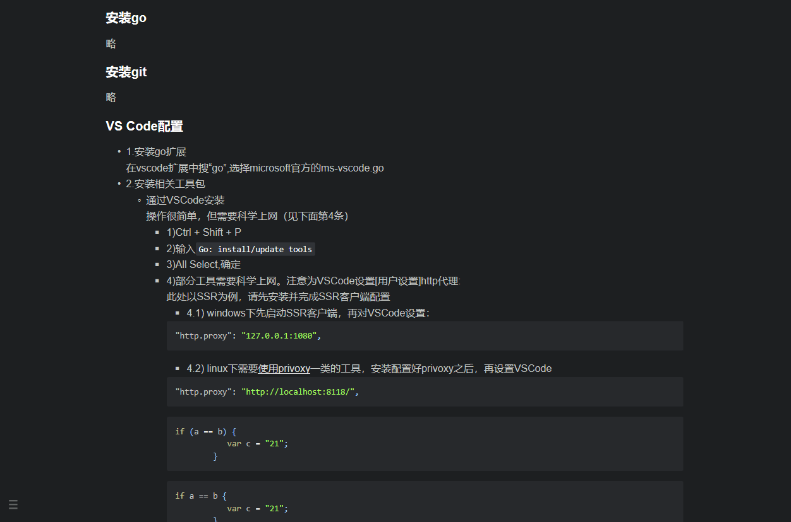
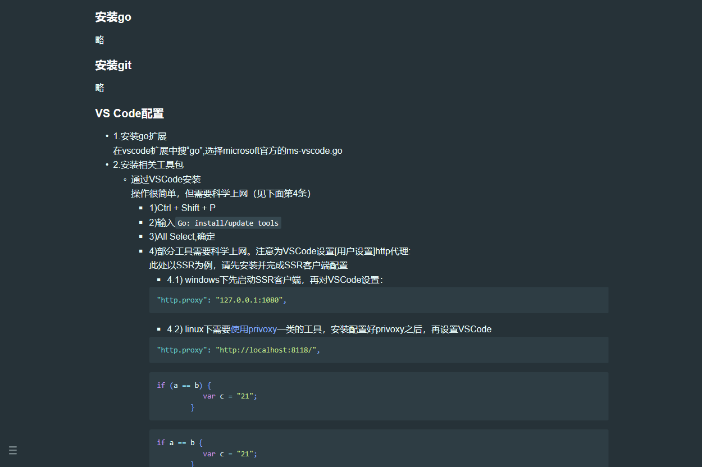
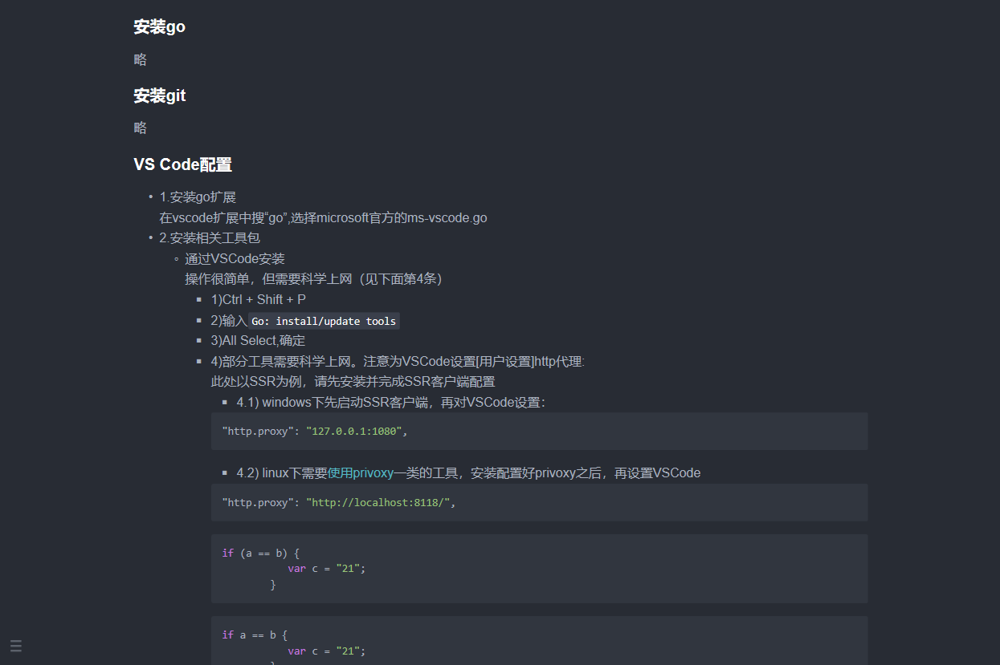
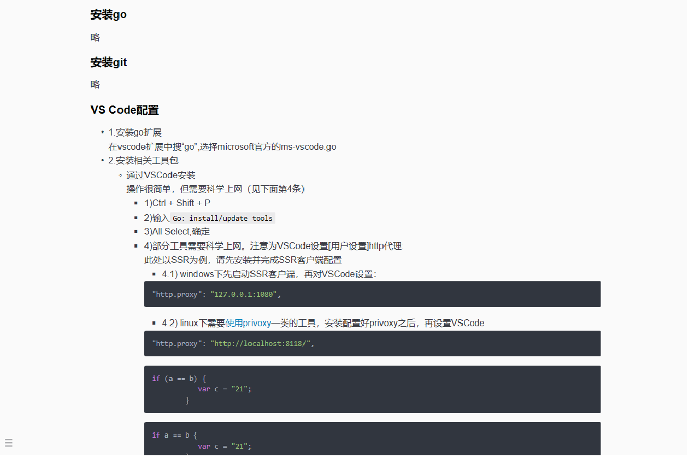
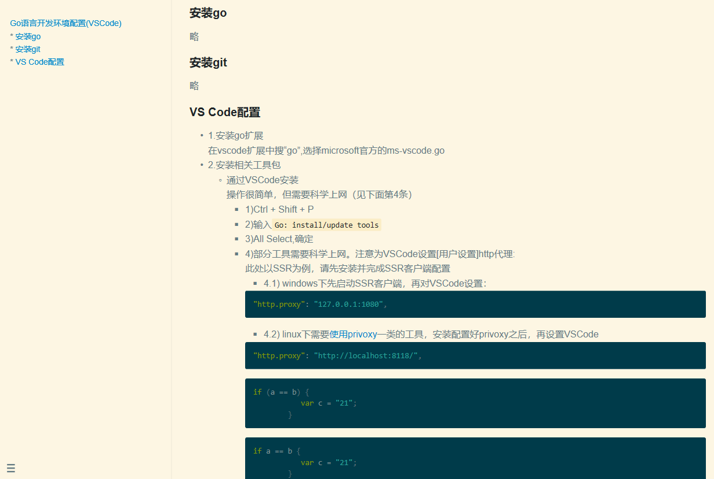
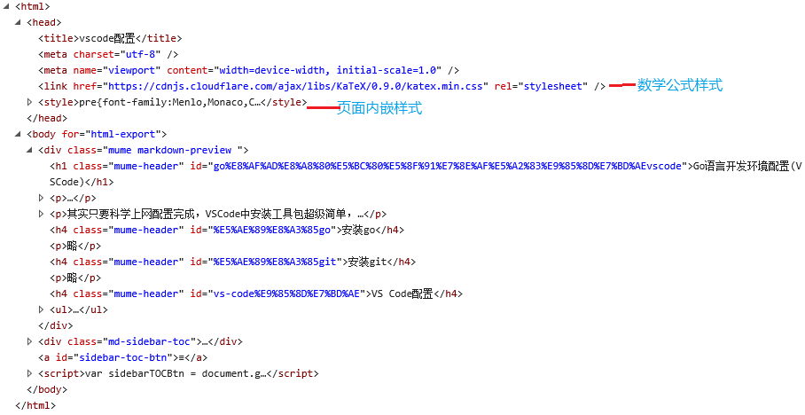

javascript,markdown  
# 优秀的Markdown引擎-MUME  
> 因项目需要，尝试了[markdown.js]和[GitHub的Markdown Web API]，都不尽如人意，于是将目标对准了大名鼎鼎Markdown Preview Enhanced插件，翻其源码，最终挖出的背后功臣MUME。如此优秀的Markdown引擎，其在GitHub上的Star仅有83个，着实让人意外。  

## 调用简单  
以导出为html为例：  
``` javascript  
//引入  
const mume = require("@shd101wyy/mume");  

async function main() {  
  // 初始化  
  await mume.init();  
  
  // 创建Markdown Engine实例  
  const engine = new mume.MarkdownEngine({  
    filePath: "/Users/wangyiyi/Desktop/markdown-example/test3.md",  
    config: {  
      previewTheme: "github-light.css",  
      codeBlockTheme: "default.css",  
      printBackground: true,  
      enableScriptExecution: true, // <= for running code chunks  
    },  
  });  

  // 导出Markdown为html格式  
  await engine.htmlExport({ offline: false, runAllCodeChunks: true });  
}  
main();  
```  
上面代码中完成了**mume的导入**，**初始化**，**源文件指定**，**目标样式指定**及**导出**  

## 功能强大  
#### 导出多种格式  
在官方示例代码中可以清晰的看到：  
``` javascript  
  // open in browser  
  await engine.openInBrowser({ runAllCodeChunks: true });  

  // html export  
  await engine.htmlExport({ offline: false, runAllCodeChunks: true });  

  // chrome (puppeteer) export  
  await engine.chromeExport({ fileType: "pdf", runAllCodeChunks: true }); // fileType = 'pdf'|'png'|'jpeg'  

  // phantomjs export  
  await engine.phantomjsExport({ fileType: "pdf", runAllCodeChunks: true }); // fileType = 'pdf'|'png'|'jpeg'  

  // prince export  
  await engine.princeExport({ runAllCodeChunks: true });  

  // ebook export  
  await engine.eBookExport({ fileType: "epub" }); // fileType=`epub`|`pdf`|`mobi`|`html`  

  // pandoc export  
  await engine.pandocExport({ runAllCodeChunks: true });  

  // markdown(gfm) export  
  await engine.markdownExport({ runAllCodeChunks: true });  
  ```  
####  自带丰富样式  
- 预览样式  
  ``` javascript  
  previewTheme: 'github-light.css',  
  // "atom-dark.css",  
  // "atom-light.css",  
  // "atom-material.css",  
  // "github-dark.css",  
  // "github-light.css",  
  // "gothic.css",  
  // "medium.css",  
  // "monokai.css",  
  // "newsprint.css",  
  // "night.css",  
  // "none.css",  
  // "one-dark.css",  
  // "one-light.css",  
  // "solarized-dark.css",  
  // "solarized-light.css"  
  // "vue.css"  
  ```  
- 代码块样式  
  ``` javascript  
  codeBlockTheme: 'auto.css',  
  //  "auto.css",  
  //  "default.css",  
  //  "atom-dark.css",  
  //  "atom-light.css",  
  //  "atom-material.css",  
  //  "coy.css",  
  //  "darcula.css",  
  //  "dark.css",  
  //  "funky.css",  
  //  "github.css",  
  //  "hopscotch.css",  
  //  "monokai.css",  
  //  "okaidia.css",  
  //  "one-dark.css",  
  //  "one-light.css",  
  //  "pen-paper-coffee.css",  
  //  "pojoaque.css",  
  //  "solarized-dark.css",  
  //  "solarized-light.css",  
  //  "twilight.css",  
  //  "vue.css"  
  //  "vs.css",  
  //  "xonokai.css"  
  ```  
  - 几个样例  
      
      
      
      
      
#### 支持数学公式渲染  
- KaTeX渲染库  
- MathJax渲染库  

#### 导出代码易用  
MUME导出的html代码结构清晰，便于修改再利用  
  

### 其他  
更多功能请见[官方GitHub库](https://github.com/shd101wyy/mume)说明  
