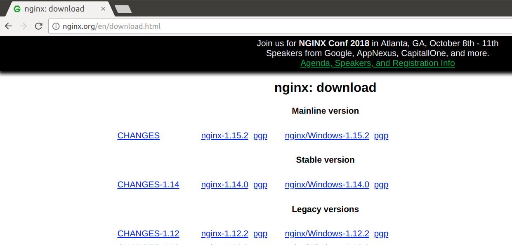
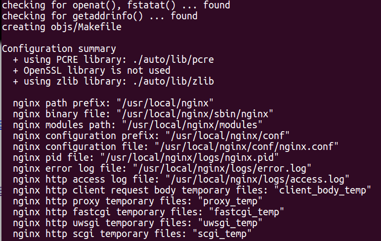
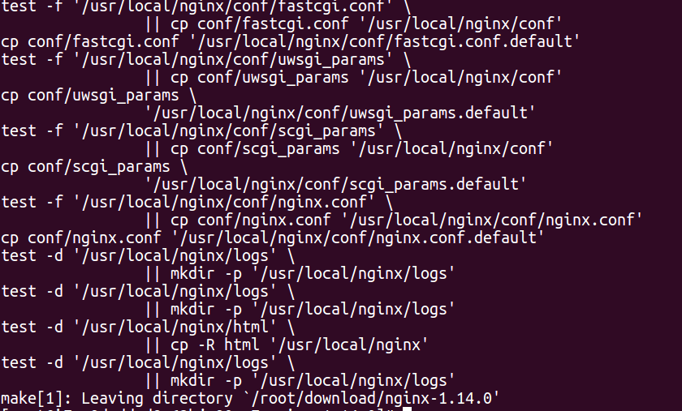
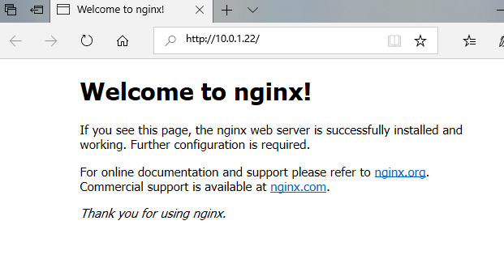

nginx
# nginx之安装  
## 下载  
- 到[nginx官网下载](http://nginx.org/en/download.html)  
    
  建议下载稳定版本(Stable version)  
  - CHANGES-1.14  
    版本更新日志  
  - nginx-1.14.0  
    源码，Mac、Linux通过编译此源码安装  
  - nginx/Windows-1.14.0  
    window版的nginx。下载解压后直接运行nginx.exe  
  - pgp  
    文件签名，用以文件验证  
- 通过wget命令  
  本文以CentOS下安装nginx为例，wget的用法见后文  
## 安装全步骤  
### yum安装  
  > yum默认安装的nginx版本较老（写本文时版本为1.10.2-1），如果你想安装最新稳定版，请参考**手动安装**  
  ```  
  yum install nginx  
  ```  
  如果可以安装，会提示：  
  ``` shell  
  确定吗？[y/N]  
  ```  
  输入`y`回车，继续安装，完毕！  
### 手动安装  
- 下载  
  ``` shell  
  cd ~/download/  
  wget -c http://nginx.org/download/nginx-1.14.0.tar.gz  

  ```  
  > **下载地址**可通过在官网页面右键单击要下载的文件链接，选择“复制链接”获取。  
- 解压  
  ``` shell  
  tar zxvf nginx-1.14.0.tar.gz  
  ```  
- 编译安装  
  - 编译环境准备  
    ``` shell  
    yum -y install gcc gcc-c++ autoconf automake make  
    yum -y install zlib zlib-devel openssl openssl--devel pcre pcre-devel  
    ```  
  - 配置  
    ``` shell  
    cd nginx-1.14.0  
    ./configure  
    ```  
    出现如下信息，说明配置成功！  
      
  - 编译并安装  
    ``` shell  
    make && make install  
    ```  
    安装成功！  
      
## 测试  
在浏览器中输入nginx服务器IP并回车，显示nginx欢迎页面  
  


